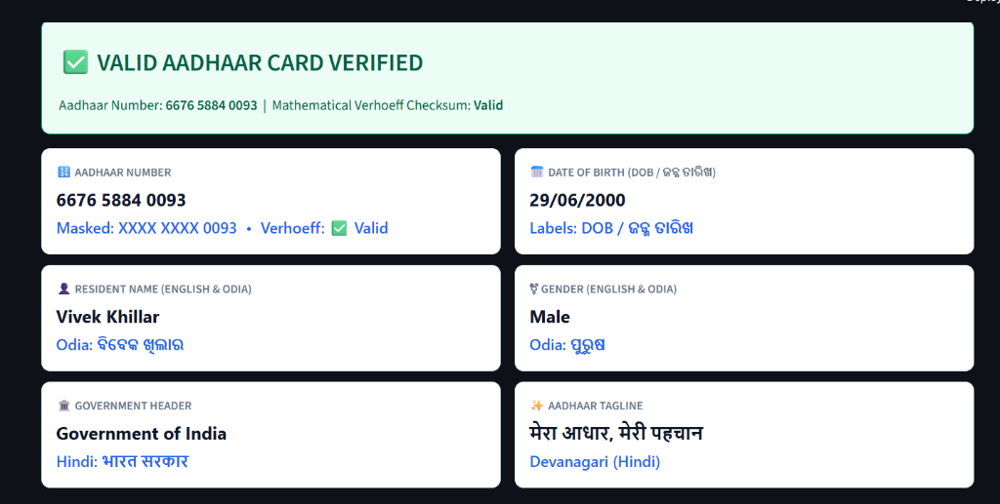
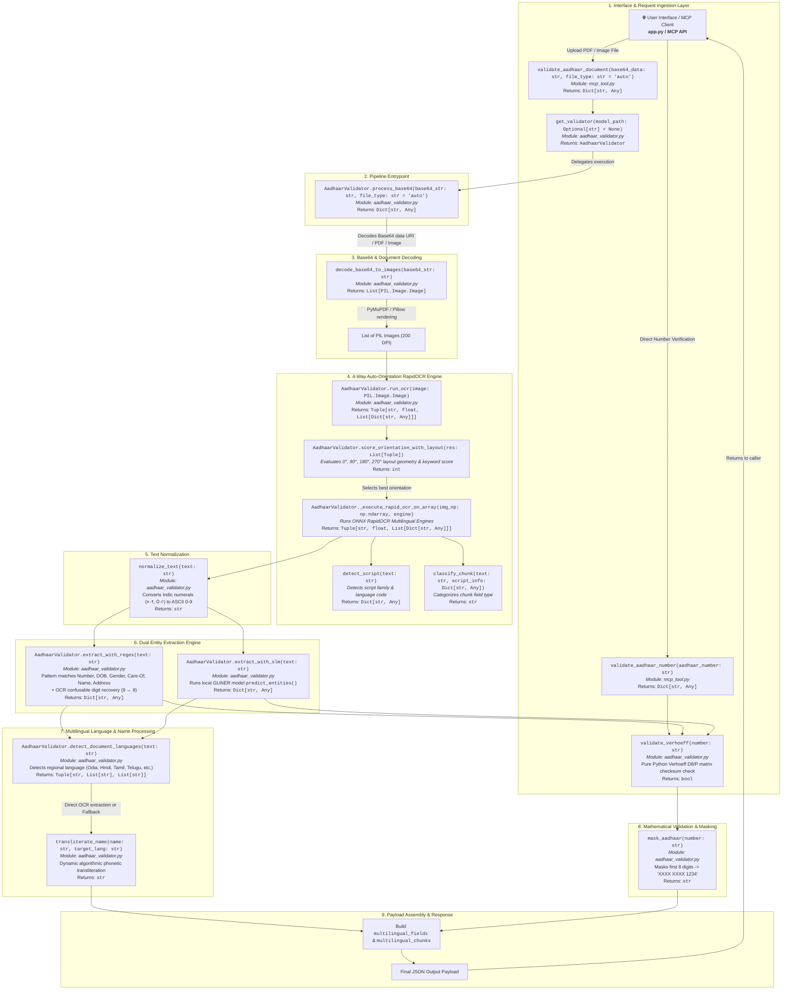

# Aadhaar MCP Validator (Offline SLM + RapidOCR)

A lightweight, enterprise-ready **MCP Tool** for validating and extracting Aadhaar card details from **Base64 documents** (PDF, JPEG, JPG, PNG, WEBP, BMP, TIFF) using a **local Small Language Model (SLM)** and **RapidOCR**.

> [!NOTE]
> **Key Features & Architecture**:
> - **Local Processing**: Processes documents locally using ONNX runtime and local model files without external API dependencies.
> - **Dual Extraction Pipeline**: Combines **Multilingual RapidOCR** text detection with **GLiNER Small Language Model (SLM)** entity recognition.
> - **Mathematical Validation**: Uses the pure-Python **Verhoeff Checksum Algorithm** for 100% accurate 12-digit Aadhaar number verification.
> - **Base64 & Multi-Format Support**: Directly decodes and processes PDF, PNG, JPG, JPEG, WEBP, BMP, and TIFF Base64 inputs.


---

## 📁 Project File Structure

```text
GLINER/
├── app.py                   # 🌐 Interactive Streamlit UI (Upload file -> Base64 -> MCP -> UI)
├── aadhaar_validator.py     # ⚙️ Core Engine: Base64 decoding, Multilingual RapidOCR, GLiNER SLM, Verhoeff & Transliteration
├── mcp_tool.py              # 🔌 MCP Server & Tool interface (stdio & SSE transport on :8090)
├── test_app.py              # 🧪 Verification test suite (Verhoeff, Indic numerals, SLM, Inversion tests)
├── requirements.txt         # 📦 Dependencies (rapidocr_onnxruntime, pymupdf, pillow, mcp, streamlit, gliner)
├── mcp_config.json          # ⚙️ Standard MCP client configuration
├── README.md                # 📖 System documentation & Architecture guide
├── vendor/                  # 📦 Offline wheel packages for air-gapped environments
└── models/                  # 🤖 Local Model Assets
    ├── rapidocr_multilingual/  # 🇮🇳 MULTILINGUAL INDIAN GOVT ID OCR MODELS
    │   ├── hindi/              # rec.onnx + dict.txt (Hindi / Marathi / Devanagari)
    │   ├── tamil/              # rec.onnx + dict.txt (Tamil)
    │   └── telugu/             # rec.onnx + dict.txt (Telugu)
    │
    └── gliner_model/           # 📦 LOCAL GLiNER SLM DIRECTORY (Named Entity Recognition)
        ├── pytorch_model.bin        (664 MB model weights)
        ├── gliner_config.json       (Model architecture config)
        ├── tokenizer.json           (Offline tokenizer vocab)
        └── tokenizer_config.json    (Tokenizer settings)
```

---

## 🔍 How It Works: Technical Deep Dive

### 1️⃣ Base64 Document Collection & Decoding
- **Entry Points**: [`validate_aadhaar_document(base64_data)`](file:///c:/Users/Vivek/GIT%20Projects/GLINER/mcp_tool.py#L35) in `mcp_tool.py` $\rightarrow$ `process_base64(base64_str)` in `aadhaar_validator.py`.
- **Handling Inputs**: Supports raw Base64 strings or Data URIs (e.g. `data:image/png;base64,...`, `data:application/pdf;base64,...`).
- **Decoding Mechanism**:
  1. Header prefixes are stripped out automatically.
  2. Raw bytes are decoded using `base64.b64decode()`.
  3. **PDF Files**: Renders page streams to high-resolution 200 DPI images using PyMuPDF (`fitz.open()`).
  4. **Image Files (PNG, JPG, WEBP, BMP, TIFF)**: Pillow (`PIL.Image.open()`) reads image bytes into NumPy arrays (`np.ndarray`) for computer vision processing.

### 2️⃣ RapidOCR Multilingual Capabilities & Indian Character Detection
- **How RapidOCR is Enhanced**: Standard RapidOCR only comes with default English/Chinese dictionaries. In this project, **RapidOCR capabilities are enhanced** by dynamically loading custom ONNX recognition models (`rec.onnx`) and character dictionary key files (`dict.txt`) for Indian regional scripts (Hindi/Devanagari, Tamil, Telugu, Odia, Bengali, etc.).
- **Key Functions**:
  - `load_rapidocr_instance(rec_model_path, rec_keys_path)`: Instantiates `MultilingualRapidOCR` configured with script-specific ONNX neural network weights and dictionary keys.
  - `_execute_rapid_ocr_on_array(img_np, engine)`: Runs text detection (`TextDetector`), direction classification (`TextClassifier`), and character glyph recognition (`TextRecognizer`).
  - `score_orientation_with_layout()`: Evaluates image rotations at **0°, 90°, 180°, 270°** and selects the best upright orientation based on keyword scoring and vertical bounding box layout geometry.
  - `normalize_text()` & `INDIC_DIGIT_MAP`: Automatically converts Indic script numerals (e.g., Devanagari `०-९`, Odia `୦-୯`) to standard ASCII digits `0-9`.

### 3️⃣ Entity Extraction via GLiNER Small Language Model (SLM)
- **What is GLiNER?**: GLiNER (Generalist Model for Named Entity Recognition) is a lightweight bidirectional transformer model capable of **zero-shot entity extraction**. Instead of relying on static entity classes (like standard `PER` or `LOC`), GLiNER takes custom target prompt labels at inference time.
- **Target Label Prompting**:
  In [`aadhaar_validator.py` (Line 882)](file:///c:/Users/Vivek/GIT%20Projects/GLINER/aadhaar_validator.py#L882), target entity prompt labels are passed into `predict_entities()`:
  ```python
  labels = ["person", "aadhaar_number", "date of birth", "gender", "address"]
  entities = self.slm_model.predict_entities(text, labels, threshold=0.45)
  ```
  Passing `labels` prompts GLiNER to scan raw OCR text and pinpoint exact text spans corresponding to candidate entities with high precision confidence scores.
- **Role of `gliner` in `requirements.txt`**:
  - `models/gliner_model/` contains local **model weights & files** (`pytorch_model.bin`, `gliner_config.json`, tokenizers).
  - `gliner>=0.2.13` in `requirements.txt` installs the **Python package library** (`from gliner import GLiNER`) required to load model weights into memory and run `.predict_entities()`.

### 4️⃣ Multilingual Processing & Indian Regional Language Pipeline
How the system identifies non-English words (Hindi, Odia, Tamil, Telugu, Kannada, Marathi, etc.):

| Step | Function / Engine | Technical Operation |
| :--- | :--- | :--- |
| **1. Non-English OCR Retrieval** | **RapidOCR Multilingual** | Image pixels are scanned using custom `rec.onnx` weights and `dict.txt` character key maps to extract raw Unicode strings (e.g. `"Government of India"`, `"भारत सरकार"`, `"Vivek Khillar"`, `"ବିବେକ ଖିଲାର"`). |
| **2. Document Language Detection** | `detect_document_languages()` | Inspects Unicode character ranges (`\u0900-\u097F` Devanagari, `\u0B00-\u0B7F` Odia, `\u0B80-\u0BFF` Tamil, `\u0C00-\u0C7F` Telugu, `\u0C80-\u0CFF` Kannada) to identify document language. |
| **3. Adjacent Line Unicode Matching** | `process_base64()` (L1079–1096) | Locates the English name (e.g., `"Vivek Khillar"`) and checks lines directly above or below for matching Indic Unicode characters (e.g., `"ବିବେକ ଖିଲାର"` or `"विवेक खिल्लार"`). |
| **4. Phonetic Transliteration (Fallback)** | `transliterate_name()` | If regional text is blurry on low-quality cards, `transliterate_name()` dynamically converts English phonetics into the target Indic script without remote APIs or hardcoded dictionaries. |

### 5️⃣ Mathematical Verification & Masking
- **Verhoeff Algorithm (`validate_verhoeff`)**: Validates the extracted 12-digit number against Dihedral group $D_5$ multiplication & permutation matrices to guarantee mathematical validity.
- **Number Masking (`mask_aadhaar`)**: Formats valid numbers into secure masked strings (`XXXX XXXX 1234`).

---

## 🌐 Launch the Interactive Streamlit UI

Run the user-friendly web interface:
```bash
streamlit run app.py
```
- **Upload any file** (PDF, PNG, JPG, JPEG, WEBP).
- Automatically encodes it to **Base64** and sends it to the MCP tool.
- Displays the **preview**, **mathematical Verhoeff status**, **metric cards**, **bilingual raw OCR text**, and **full JSON payload**.



---

## 🖥️ Standalone CLI & MCP Server Execution

### 1. Direct Python CLI Evaluation
Run document extraction directly from the command line on any image or PDF file:
```bash
python aadhaar_validator.py <path_to_image_or_pdf>
```

### 2. Standalone MCP Server Launch
Run the Model Context Protocol (MCP) server over standard input/output (`stdio`) or Server-Sent Events (`sse`):
```bash
# Stdio transport (Default for AI IDE / Claude / Antigravity integrations)
python mcp_tool.py --transport stdio

# SSE transport on port 8090
python mcp_tool.py --transport sse --port 8090
```

---

## 📍 Where is the Local Model File?

The complete model is downloaded and saved in:
```text
GLINER/models/gliner_model/
```
It contains:
1. `pytorch_model.bin` — The GLiNER weights.
2. `gliner_config.json` — The SLM model configuration.
3. `tokenizer.json` — Offline tokenizer dictionary.
4. `tokenizer_config.json` — Tokenizer configuration.

**To deploy to your offline enterprise server:**
Simply copy the `models/gliner_model/` folder along with `aadhaar_validator.py`!

---

## 🔌 How to Integrate into Your Existing MCP Project

You only need **2 lines of code** to add this tool to your existing FastMCP server:

```python
# In your existing MCP server file (e.g., server.py):
from mcp.server.fastmcp import FastMCP
from aadhaar_validator import AadhaarValidator

# 1. Initialize your existing MCP instance
mcp = FastMCP("my-enterprise-mcp-server")

# 2. Initialize the validator (points to local models/gliner_model)
aadhaar_validator = AadhaarValidator(model_path="models/gliner_model")

# 3. Register the tool
@mcp.tool()
def validate_aadhaar_document(base64_data: str, file_type: str = "auto") -> dict:
    """
    Validate and extract Aadhaar card details from Base64 PDF or image.
    Performs RapidOCR, local SLM entity extraction, and Verhoeff validation.
    """
    return aadhaar_validator.process_base64(base64_data, file_type=file_type)

@mcp.tool()
def validate_aadhaar_number(aadhaar_number: str) -> dict:
    """Validate 12-digit Aadhaar number with pure Python Verhoeff algorithm."""
    return aadhaar_validator.validate_number(aadhaar_number)
```

---

## 🔄 Complete Flow Architecture & Function Graph

Below is the complete flow graph detailing every execution step, function name, parameter list, return type, and module interaction across the pipeline:



---

### Detailed Function & Parameter Reference

| Function Name | Location / Scope | Parameters & Types | Return Type | Description & Role |
| :--- | :--- | :--- | :--- | :--- |
| `validate_aadhaar_document` | `mcp_tool.py` | `base64_data: str`, `file_type: str = "auto"` | `Dict[str, Any]` | MCP tool entrypoint to process base64 encoded Aadhaar card documents. |
| `validate_aadhaar_number` | `mcp_tool.py` | `aadhaar_number: str` | `Dict[str, Any]` | MCP tool entrypoint for direct 12-digit number validation via Verhoeff. |
| `get_validator` | `aadhaar_validator.py` | `model_path: Optional[str] = None` | `AadhaarValidator` | Singleton getter function to instantiate/reuse `AadhaarValidator`. |
| `process_base64` | `aadhaar_validator.py` | `base64_str: str`, `file_type: str = "auto"` | `Dict[str, Any]` | Core pipeline master orchestrator function handling decoding, OCR, extraction, and validation. |
| `decode_base64_to_images` | `aadhaar_validator.py` | `base64_str: str` | `List[PIL.Image.Image]` | Decodes raw Base64 string / Data URI; renders multi-page PDFs to images via PyMuPDF or opens image formats via PIL. |
| `run_ocr` | `aadhaar_validator.py` | `image: PIL.Image.Image` | `Tuple[str, float, List[Dict[str, Any]]]` | Executes RapidOCR with 4-Way Auto-Orientation Recovery (0°, 90°, 180°, 270°) and vertical layout geometry scoring. |
| `score_orientation_with_layout` | `aadhaar_validator.py` | `res: List[Tuple]` | `int` | Evaluates composite rotation score based on keywords, Verhoeff number presence, and top-to-bottom spatial geometry (`header_y < number_y`). |
| `_execute_rapid_ocr_on_array` | `aadhaar_validator.py` | `img_np: np.ndarray`, `engine: RapidOCR` | `Tuple[str, float, List[Dict[str, Any]]]` | Runs ONNX text detection, direction classification, and text recognition on numpy image array. |
| `detect_script` | `aadhaar_validator.py` | `text: str` | `Dict[str, Any]` | Analyzes Unicode ranges to detect script (Devanagari, Odia, Tamil, Telugu, Kannada, Latin, Numeric) and ISO language code. |
| `classify_chunk` | `aadhaar_validator.py` | `text: str`, `script_info: Dict[str, Any]` | `str` | Classifies text chunk into semantic categories (`GOVERNMENT_HEADER`, `AADHAAR_NUMBER`, `DOB`, `GENDER`, `NAME_ENGLISH`, `NAME_REGIONAL`, etc.). |
| `normalize_text` | `aadhaar_validator.py` | `text: str` | `str` | Normalizes Indic script numerals ( Devangari ०-९, Odia ୦-୯, Tamil, Telugu, etc.) into ASCII digits (0-9). |
| `extract_with_regex` | `aadhaar_validator.py` | `text: str` | `Dict[str, Any]` | RegEx pattern extraction for 12-digit number (with single OCR confusable digit recovery), DOB, Gender, Care-Of, Name, and Address. |
| `extract_with_slm` | `aadhaar_validator.py` | `text: str` | `Dict[str, Any]` | Runs local GLiNER Small Language Model (`predict_entities`) for `person`, `aadhaar_number`, `date of birth`, `gender`, `address`. |
| `detect_document_languages` | `aadhaar_validator.py` | `text: str` | `Tuple[str, List[str], List[str]]` | Identifies all document languages and scripts (e.g. Odia, Hindi, English) present in the text. |
| `transliterate_name` | `aadhaar_validator.py` | `name: str`, `target_lang: str` | `str` | Performs dynamic algorithmic phonetic transliteration of English names into target Indic script without hardcoding. |
| `validate_verhoeff` | `aadhaar_validator.py` | `number: str` | `bool` | Mathematically validates 12-digit Aadhaar checksum using Dihedral group D5 multiplication and permutation matrices. |
| `mask_aadhaar` | `aadhaar_validator.py` | `number: str` | `str` | Masks first 8 digits of a valid 12-digit Aadhaar number returning formatted string (`XXXX XXXX 1234`). |

---

## 📋 JSON Output Schema

The validator returns a comprehensive, structured JSON payload matching the verified output:

```json
{
  "status": "success",
  "is_aadhaar": true,
  "data": {
    "aadhaar_number": "6676 5884 0093",
    "aadhaar_number_masked": "XXXX XXXX 0093",
    "is_verhoeff_valid": true,
    "name": "Vivek Khillar",
    "name_regional": "ବିବେକ ଖିଲାର",
    "dob": "29/06/2000",
    "gender": "Male",
    "care_of": null,
    "address": null,
    "address_regional": null,
    "multilingual_fields": {
      "name": {
        "english": "Vivek Khillar",
        "regional": "ବିବେକ ଖିଲାର",
        "regional_language": "Odia"
      },
      "dob": {
        "value": "29/06/2000",
        "english_label": "DOB",
        "regional_label": "ଜନ୍ମ ତାରିଖ",
        "regional_language": "Odia"
      },
      "gender": {
        "english": "Male",
        "regional": "ପୁରୁଷ",
        "regional_language": "Odia"
      },
      "government_header": {
        "english": "Government of India",
        "hindi": "भारत सरकार"
      },
      "tagline": {
        "hindi": "मेरा आधार, मेरी पहचान"
      }
    }
  },
  "multilingual_chunks": [
    {
      "chunk_id": 1,
      "text": "भारतसरकार",
      "script": "Devanagari (Hindi/Marathi)",
      "language": "Hindi / Marathi / Devanagari",
      "language_code": "hi",
      "is_indic": true,
      "category": "GOVERNMENT_HEADER",
      "confidence": 0.899
    },
    {
      "chunk_id": 2,
      "text": "Government of India",
      "script": "English (Latin)",
      "language": "English",
      "language_code": "en",
      "is_indic": false,
      "category": "GOVERNMENT_HEADER",
      "confidence": 0.922
    },
    {
      "chunk_id": 3,
      "text": "आधार",
      "script": "Devanagari (Hindi/Marathi)",
      "language": "Hindi / Marathi / Devanagari",
      "language_code": "hi",
      "is_indic": true,
      "category": "GOVERNMENT_HEADER",
      "confidence": 0.880
    },
    {
      "chunk_id": 4,
      "text": "ବିବେକ ଖିଲାର",
      "script": "Odia (Oriya)",
      "language": "Odia",
      "language_code": "or",
      "is_indic": true,
      "category": "NAME_REGIONAL",
      "confidence": 0.915
    },
    {
      "chunk_id": 5,
      "text": "Vivek Khillar",
      "script": "English (Latin)",
      "language": "English",
      "language_code": "en",
      "is_indic": false,
      "category": "NAME_ENGLISH",
      "confidence": 0.928
    },
    {
      "chunk_id": 6,
      "text": "ଜନ୍ମ ତାରିଖ / DOB: 29/06/2000",
      "script": "English (Latin) + Odia (Oriya)",
      "language": "English / Odia",
      "language_code": "en_or",
      "is_indic": true,
      "category": "DOB",
      "confidence": 0.85
    },
    {
      "chunk_id": 7,
      "text": "ପୁରୁଷ / Male",
      "script": "English (Latin) + Odia (Oriya)",
      "language": "English / Odia",
      "language_code": "en_or",
      "is_indic": true,
      "category": "GENDER",
      "confidence": 0.8
    },
    {
      "chunk_id": 8,
      "text": "6676 5884 0093",
      "script": "Numeric",
      "language": "Numeric Digits",
      "language_code": "num",
      "is_indic": false,
      "category": "AADHAAR_NUMBER",
      "confidence": 0.886
    },
    {
      "chunk_id": 9,
      "text": "मेरा आधार, मेरी पहचान",
      "script": "Devanagari (Hindi/Marathi)",
      "language": "Hindi / Marathi / Devanagari",
      "language_code": "hi",
      "is_indic": true,
      "category": "TEXT_CONTENT",
      "confidence": 0.914
    }
  ],
  "detected_scripts": [
    "English (Latin)",
    "Devanagari (Hindi/Marathi)",
    "Odia (Oriya)",
    "Numeric"
  ],
  "detected_languages": [
    "English",
    "Hindi",
    "Odia"
  ],
  "meta": {
    "processing_time_sec": 0.428,
    "ocr_confidence": 0.886,
    "model_used": "RapidOCR + GLiNER-SLM (local) + Regex",
    "chunks_count": 9
  },
  "raw_text": "Government of India\nभारत सरकार\nआधार\nବିବେକ ଖିଲାର\nVivek Khillar\nDOB: 29/06/2000\nMALE\n6676 5884 0093\nमेरा आधार, मेरी पहचान"
}
```

---

## 🧪 Testing

Run the verification test:
```bash
python test_app.py
```
This tests:
1. Verhoeff algorithm validation & masking.
2. Indic numeral transliteration (Hindi, Tamil, Telugu).
3. Local GLiNER SLM extraction from `models/gliner_model`.
4. Synthetic Aadhaar card rendering -> Base64 encoding -> RapidOCR -> Full pipeline extraction.
